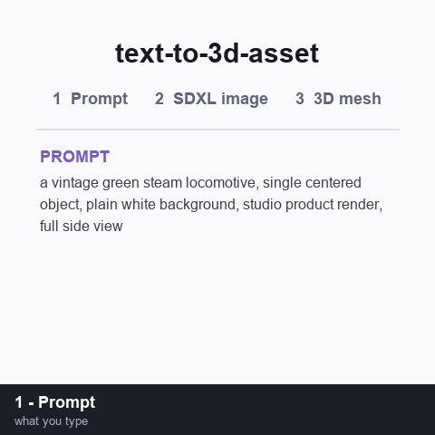

# text-to-3d-asset (macOS + Docker)

A [Claude Code](https://claude.com/claude-code) **skill** that turns a text prompt or a photo into a
**game-ready, textured 3D asset** by orchestrating local AI services in sequence — then (optionally)
imports it straight into an Unreal Engine project.

```
prompt ──▶ Fooocus (SDXL)  ──▶  image.png
image  ──▶ Hunyuan3D-2      ──▶  textured .glb
.glb   ──▶ Blender          ──▶  .fbx
.fbx   ──▶ Unreal (MCP)     ──▶  StaticMesh / BP racer
```

> **This repository is a macOS + Docker conversion of the upstream**
> [unreal-game-assets-creation-skill](https://github.com/LaurentiuGabriel/unreal-game-assets-creation-skill).
> The upstream skill was built and validated on a single Windows workstation
> (RTX 4070 Laptop, 8 GB VRAM / 32 GB RAM). This fork rewrites the Windows paths,
> PowerShell launchers, and embedded runtimes for macOS — using Docker containers for
> Blender (GLB → FBX) and optionally Fooocus / Hunyuan3D-2 — and keeps every HTTP
> client script platform-neutral behind `FOOCUS_URL` / `HUNYUAN_URL` env vars.

## Example

A real run of the original pipeline — the prompt below became an SDXL image (Fooocus), then a textured
`.glb` (Hunyuan3D‑2), shown here as a turntable of the generated mesh:



> Prompt: *"a vintage green steam locomotive, single centered object, plain white background,
> studio product render, full side view"* — every frame after the title card is an actual output of
> this skill (image from Fooocus, 3D turntable rendered from the Hunyuan3D‑2 `.glb`).

## What it does

| Stage | Tool | Output |
|-------|------|--------|
| 1. Text → image *(optional)* | [Fooocus](https://github.com/lllyasviel/Fooocus) SDXL, driven headlessly via the [Fooocus-API](https://github.com/mrhan1993/Fooocus-API) REST wrapper | `.png` |
| 2. Image → 3D | [Hunyuan3D‑2](https://github.com/Tencent-Hunyuan/Hunyuan3D-2) (image‑to‑textured‑mesh) | textured `.glb` |
| 3. Convert | [Blender](https://www.blender.org/) headless, in Docker (`glTF → FBX`, embedded textures) | `.fbx` |
| 4. Import *(optional)* | Unreal Engine via the `unreal-mcp` server | StaticMesh + Blueprint |

If you already have a photo, skip Stage 1 and start at Stage 2.

## Contents

```
SKILL.md                 # the skill instructions Claude Code loads
scripts/fooocus_gen.py   # text → image via the Fooocus-API REST endpoint (FOOCUS_URL)
scripts/hunyuan_gen.py   # image → textured GLB via Hunyuan3D-2 (HUNYUAN_URL);
                         #   --server auto speaks gradio_app.py AND api_server.py
scripts/glb_to_fbx.py    # GLB → FBX (embedded textures) via headless Blender
scripts/validate_outputs.py  # structural validation of PNG/GLB/FBX artifacts
Dockerfile.blender       # headless Blender 4.x (Ubuntu 24.04) for the FBX conversion
Dockerfile.hunyuan       # BEST-EFFORT, unofficial Hunyuan3D-2 container (CUDA/amd64)
docker-compose.yml       # fooocus + blender-fbx + (optional) hunyuan services
bin/glb_to_fbx.sh        # one-shot GLB→FBX (docker, local blender, or bpy runner)
requirements.txt         # client-side pip deps (requests; gradio_client for gradio mode)
docs/PLAN.md             # the line-by-line remediation & validation plan
docs/EXAMPLES.md         # text-in → asset-out gallery (real + sandbox-validated runs)
docs/VALIDATION.md       # what was executed where, and what still needs a GPU
tests/                   # mock AI servers + end-to-end no-GPU test suite
examples/                # runnable pipeline scripts, prompt library, fixture assets
```

## Requirements

- **macOS** (Apple Silicon or Intel) with [Docker Desktop](https://www.docker.com/products/docker-desktop/) (or colima/rancher) and Python 3.10+.
- Python client deps:
  ```bash
  python3 -m venv ~/AI/venv && source ~/AI/venv/bin/activate
  pip install -r requirements.txt
  ```
- An Unreal project with the `unreal-mcp` server (only for Stage 4 import).

### Apple Silicon honesty note — please read

- **Hunyuan3D-2 and Fooocus are CUDA-oriented.** The models were trained and are normally run on
  NVIDIA GPUs. On Apple Silicon you should expect **CPU / MPS operation (or a remote NVIDIA box)**, not
  equal performance to an 8 GB RTX card. Generation will be noticeably slower and may need reduced
  resolutions / `--low_vram_mode`-style flags.
- **Fooocus-API image is amd64-only**: `konieshadow/fooocus-api:latest`. On Apple Silicon Docker runs
  it under emulation on CPU with no CUDA access — it works but is slow. Prefer running it on a
  Linux/NVIDIA host and setting `FOOCUS_URL=http://<host>:8888`.
- **Hunyuan3D-2 has no official Docker image.** Tencent publishes source + an `api_server.py` only.
  `Dockerfile.hunyuan` is a best-effort CUDA/amd64 build, provided for Linux/NVIDIA hosts, and is
  **not validated on Apple Silicon**. On a Mac the recommended path is **remote-service mode**: run
  Hunyuan3D-2's official server somewhere with an NVIDIA GPU and set `HUNYUAN_URL=http://<host>:8080`.
- The **Blender GLB→FBX stage is pure CPU** and runs identically on Apple Silicon via Docker.

## Quick start (macOS)

```bash
# 1. Containers
cd unreal-text-to-3d-asset-skill
docker compose up -d fooocus        # Stage 1: Fooocus-API on localhost:8888 (emulated/CPU on Apple Silicon)
# or point at a remote GPU host instead:
export FOOCUS_URL=http://my-gpu-host:8888

# 2. Stage 1 (text → image) — skip if you already have a photo
python3 scripts/fooocus_gen.py --prompt "a vintage green steam locomotive, single centered object, plain white background, studio lighting, full side view" --out ~/AI/outputs/train.png

# 3. Stage 2 (image → textured GLB) — --server auto detects gradio vs FastAPI hosts
export HUNYUAN_URL=http://localhost:8080   # or a remote GPU host
python3 scripts/hunyuan_gen.py --image ~/AI/outputs/train.png --name Locomotive --out ~/AI/outputs

# 4. Stage 3 (GLB → FBX) via the Blender container
bin/glb_to_fbx.sh ~/AI/outputs/Locomotive_textured.glb ~/AI/outputs/Locomotive_textured.fbx

# 5. Verify the artifacts are structurally sound
python3 scripts/validate_outputs.py ~/AI/outputs/train.png ~/AI/outputs/Locomotive_textured.glb ~/AI/outputs/Locomotive_textured.fbx

# 6. Stage 4: import the FBX into Unreal via unreal-mcp (see SKILL.md)
```

Or one shot: `bash examples/full_pipeline.sh "your prompt here"` — then see
**[docs/EXAMPLES.md](docs/EXAMPLES.md)** for finished text→asset examples.

## Remote-service mode

Both HTTP clients read their server URL from environment variables, so the skill works unchanged
against a remote GPU box (Linux + NVIDIA) running the same containers — no macOS GPU needed:

```bash
export FOOCUS_URL=http://gpu-box:8888
# remote box: docker compose up -d fooocus

export HUNYUAN_URL=http://gpu-box:8080
# remote box: docker compose --profile optional up -d hunyuan   # best-effort CUDA image
# or run Tencent's official api_server.py on the remote box
```

## Examples (text in → asset out)

Real prompts and the assets they produced — including the upstream GPU run
(green locomotive → `docs/demo.gif`) and assets produced & validated by this
repo's own code in a GPU-less sandbox — live in
**[docs/EXAMPLES.md](docs/EXAMPLES.md)**. Ready-to-use prompts are collected in
[examples/sample_prompts.txt](examples/sample_prompts.txt); runnable scripts in
[examples/](examples/).

## Validation — this repo is tested, not just written

The AI models need a CUDA GPU, but everything else is executable and **has been
executed** in this repo's CI sandbox. See **[docs/VALIDATION.md](docs/VALIDATION.md)**
for the full record (including the bugs the audit found and fixed).

```bash
python3 -m venv .venv && .venv/bin/pip install -r requirements.txt bpy
.venv/bin/python tests/run_tests.py          # 6 end-to-end tests (mock AI + real Blender)
PYTHON=.venv/bin/python bash tests/mock_e2e.sh  # full_pipeline.sh prompt→FBX against mocks
```

`tests/run_tests.py` drives both client scripts over real HTTP against mock
servers, runs the repo's unmodified `scripts/glb_to_fbx.py` inside Blender to
produce a real FBX (with the texture embedded), and validates every artifact.
On a Mac with Docker, `bin/glb_to_fbx.sh` uses the identical script in the
container instead.

## Install as a Claude Code skill

Copy this folder into a `.claude/skills/` directory so Claude Code discovers it:

```bash
# project-scoped (active in one project)
cp -r text-to-3d-asset  <your-project>/.claude/skills/text-to-3d-asset

# or user-scoped (active everywhere)
cp -r text-to-3d-asset  ~/.claude/skills/text-to-3d-asset
```

Then just ask, e.g. *"make me a 3D asset of a red double‑decker bus"* and the skill takes over.

## Troubleshooting

- **Hunyuan server down / not persisting**: expected across sessions — relaunch it (docker or remote
  server). It does not persist state.
- **CUDA OOM during 3D texture**: another generation is running (Fooocus?) — serialize them; lower
  `--octree` / resolution, or use `--low_vram_mode` where supported.
- **Import rejects .glb**: convert to FBX first (Stage 3 step 1).
- **First generation is slow on MPS/CPU**: models download to `~/AI`/HF cache on first run; expect
  much slower per-step times than the Windows/NVIDIA baseline. Lower resolutions help.
- **Blender import shows one mesh named `*.ply`**: normal (Hunyuan meshes carry no node name); the
  FBX still exports fine.

## Credits

Conversion to macOS + Docker by [ronncc](https://github.com/ronncc), derived from
[LaurentiuGabriel/unreal-game-assets-creation-skill](https://github.com/LaurentiuGabriel/unreal-game-assets-creation-skill)
(made with [Claude Code](https://claude.com/claude-code)). Wraps the excellent open‑source projects
linked above — all credit to their authors.
