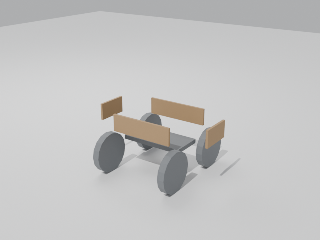
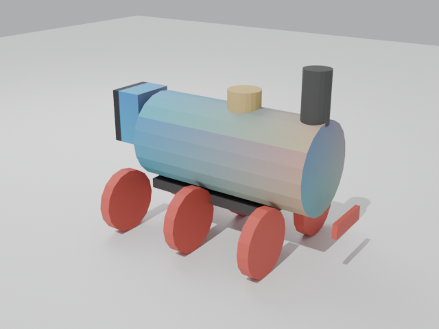
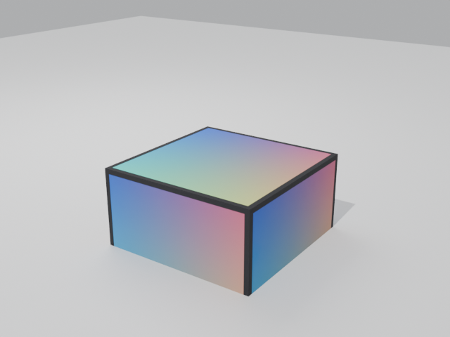
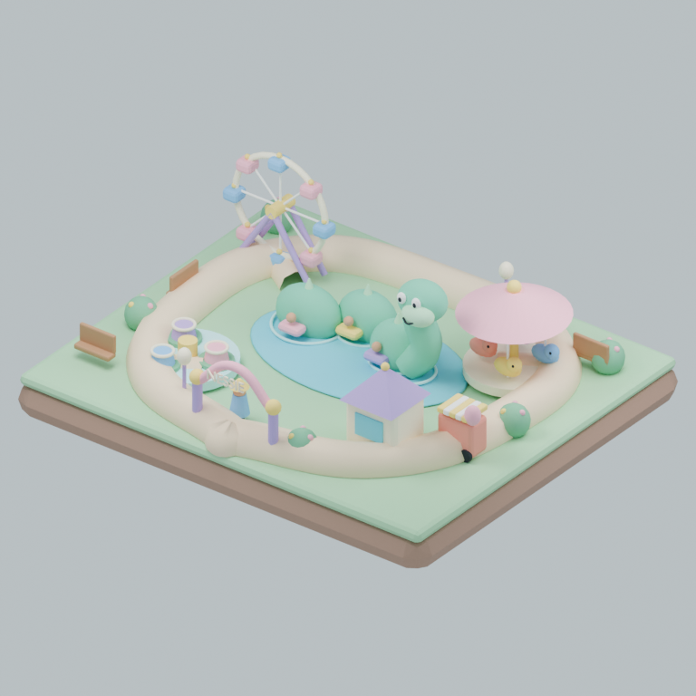

# Examples — text in, 3D assets out

Every example below lists the **exact text** fed to the pipeline and the
**exact asset** that came back, with provenance labels:

- `[upstream GPU run]` — measured on the original Windows RTX 4070 Laptop
  setup (the `docs/demo.gif` run). Real AI outputs.
- `[sandbox validation]` — produced by *this repository's code* in a
  GPU-less CI sandbox: the AI HTTP stages ran against byte-faithful mocks, and
  every GLB→FBX→render byte was produced by the repo's real Blender code path.

---

## Example A — the real end-to-end AI run (locomotive) `[upstream GPU run]`

**Stage 1 — text prompt** (verbatim from the run that produced `docs/demo.gif`):

```
a vintage green steam locomotive, single centered object, plain white
background, studio product render, full side view
```

**Stage 1 output (Fooocus SDXL):** a 1152×896 PNG (`~/AI/outputs/train.png`,
~1–2 min on the RTX 4070 Laptop).

**Stage 2 command:**

```bash
python3 scripts/hunyuan_gen.py --image ~/AI/outputs/train.png \
    --name Locomotive --out ~/AI/outputs
```

**Stage 2 output (Hunyuan3D-2):** `~/AI/outputs/Locomotive_textured.glb`
(+ `Locomotive_white.glb`), ~60–130 s per asset on the upstream GPU.

**What it looked like** — the turntable in `docs/demo.gif`: the title card is
followed by the actual SDXL image (the green locomotive) and then the actual
textured mesh rotating:


**Stages 3–4:**

```bash
bin/glb_to_fbx.sh ~/AI/outputs/Locomotive_textured.glb ~/AI/outputs/Locomotive_textured.fbx
python3 scripts/validate_outputs.py ~/AI/outputs/Locomotive_textured.fbx
# then import via unreal-mcp StaticMeshTools.import_file (see SKILL.md, Stage 3)
```

**Prompt recipe that made it work** (this is the pattern all other examples reuse):

| Prompt ingredient | Why it matters downstream |
|---|---|
| `single centered object` | Hunyuan's auto-background-removal expects ONE subject |
| `plain white background` | clean alpha cut → clean mesh silhouette |
| `full side view` / `3/4 view` | less hallucinated geometry on the far side |
| `studio product render` | even lighting → even albedo texture |

---

## Example B — goods wagon (recipe + verified outputs) `[sandbox validation]`

The same pipeline, a second asset class. The prompt below is formatted so it
can be copy-pasted into a live run; the GLB/FBX/render shown were produced in
the sandbox from an equivalent stand-in mesh (no GPU available) through this
repo's real conversion code path.

**Live-run commands (GPU host):**

```bash
python3 scripts/fooocus_gen.py \
  --prompt "a wooden open goods wagon for a narrow-gauge railway, single centered object, plain white background, studio product render, 3/4 view" \
  --out ~/AI/outputs/wagon.png
python3 scripts/hunyuan_gen.py --image ~/AI/outputs/wagon.png --name Wagon --out ~/AI/outputs
bin/glb_to_fbx.sh ~/AI/outputs/Wagon_textured.glb ~/AI/outputs/Wagon_textured.fbx
```

**Verified sandbox artifacts** (real files in this repo — see
`examples/fixtures/MANIFEST.md` for checksums):

| Artifact | Size | Structural validation (`tests/` run) |
|---|---|---|
| [`examples/fixtures/Wagon_textured.glb`](../examples/fixtures/Wagon_textured.glb) | 20 KB | GLB v2 · 1 mesh · 2 primitives · 504 verts · 2 materials |
| [`examples/fixtures/fbx/Wagon_textured.fbx`](../examples/fixtures/fbx/Wagon_textured.fbx) | 22 KB | `Kaydara FBX Binary` 7.4 header verified |

**Render of the actual GLB** (Cycles CPU, headless, from the committed file):



---

## Example C — textured locomotive stand-in, FBX with embedded texture `[sandbox validation]`

Proves the texture path end-to-end: the GLB embeds a PNG texture; after the
repo's real `scripts/glb_to_fbx.py` runs (Blender headless), the PNG is found
*inside* the FBX (`path_mode="COPY"`, `embed_textures=True`).

| Artifact | Size | Structural validation |
|---|---|---|
| [`examples/fixtures/Locomotive_textured.glb`](../examples/fixtures/Locomotive_textured.glb) | 83 KB | GLB v2 · 1 mesh · 4 primitives · 1008 verts · **1 embedded image** |
| [`examples/fixtures/fbx/Locomotive_textured.fbx`](../examples/fixtures/fbx/Locomotive_textured.fbx) | 80 KB | FBX 7.4 binary · PNG texture embedded at byte offset 37198 |



Reproduce (from the repo root, Blender via `pip install bpy` or the container):

```bash
python3 examples/fixtures/build_examples.py          # builds the GLBs
bin/glb_to_fbx.sh examples/fixtures/Locomotive_textured.glb /tmp/Locomotive_textured.fbx
python3 scripts/validate_outputs.py examples/fixtures/Locomotive_textured.glb /tmp/Locomotive_textured.fbx
```

---

## Example D — the minimal texture-embedding fixture `[sandbox validation]`

A 24-vertex cube with an embedded 256×256 PNG, hand-assembled to the glTF 2.0
spec ([`tests/fixtures/textured_cube.glb`](../tests/fixtures/textured_cube.glb),
45 KB). It is what the mock Hunyuan server returns, so **every CI run of
`tests/run_tests.py` pushes it through the real GLB→FBX converter** and asserts
the texture survives the conversion:



```
[ OK ] tests/fixtures/textured_cube.glb: GLB v2 — 1 mesh, 1 primitive,
       24 verts, 1 material, 1 embedded image, total 45 KB
[ OK ] Fixture_textured.fbx: FBX binary, format 7.4, 62 KB   (PNG embedded ✓)
```

---

## Example E — full pipeline, prompt → FBX, in one command `[sandbox validation]`

`tests/mock_e2e.sh` stands up mock AI servers and runs
**`examples/full_pipeline.sh` — the exact script a GPU user runs** — producing
and validating all three artifacts:

```bash
PYTHON=.venv/bin/python bash tests/mock_e2e.sh
```

Transcript of a real run in this sandbox (1.5 s total):

```
[1/3] Generating image from prompt via Fooocus ...      -> image.png (PNG 256x256 ✓)
[2/3] Generating 3D model from image via Hunyuan3D-2 -> MockTrain_textured.glb (GLB ✓)
[3/3] Converting GLB → FBX via Blender ...             -> MockTrain_textured.fbx (FBX 7.4 ✓)
MOCK E2E: PASS  (examples/output/mock_e2e)
```

Swap the mock URLs for real servers (`FOOCUS_URL`/`HUNYUAN_URL` pointing at
GPU hosts) and the identical script produces real AI assets.

---

## Example F — Nessie's Little Loch isometric park `[procedural sandbox build]`

A complete, compact environment example rather than a single generated prop:
Nessie forms the central family coaster, surrounded by a view wheel, lily-cup
spinner, baby-Nessie carousel, kiosk, snack cart, entrance, guest, paths and
park dressing. The editable scene and both engine interchange formats are in
[`examples/nessie_amusement_park/`](../examples/nessie_amusement_park/).



| Deliverable | Notes |
|---|---|
| [`DESIGN_AND_AUDIT.md`](../examples/nessie_amusement_park/DESIGN_AND_AUDIT.md) | Concept audit, layout, attraction roster, post-build audit and Unreal plan |
| [`build_nessie_park.py`](../examples/nessie_amusement_park/build_nessie_park.py) | Deterministic Blender generator; no external assets or textures |
| `nessie_amusement_park.blend` | Editable source, organized into named attraction collections |
| `nessie_amusement_park.glb` | glTF 2.0 · 148 meshes · 24,045 vertices · 18 materials |
| `nessie_amusement_park.fbx` | Unreal-ready FBX 7.4 produced by the repository converter |

The model and preview were built and rendered with Blender 5.0.1 CPU-only. This
is deliberately a procedural low-poly example, not an Hunyuan AI output.

---

## More prompt patterns (see `examples/sample_prompts.txt` for the full set)

**Vehicles / props for the Unreal train-racer:**

```
a red double-decker bus, single centered object, plain white background, studio product render, 3/4 side view
a black diesel shunter locomotive, single centered object, plain white background, even lighting, full side view
a railway crossing signal with barriers, single centered object, plain white background, front view
an old wooden water tower for a rail yard, single centered object, plain white background, 3/4 view
```

**Cross-domain (biomedical — shows the pipeline is not train-specific):**

```
a tissue engineering scaffold, porous PCL structure, single centered object, plain white background, isometric view
```

Expect ~1–2 min (SDXL) + ~1–2 min (Hunyuan3D-2 textured) + <5 s (FBX) per
asset on an 8 GB NVIDIA GPU `[upstream GPU run]`; the FBX and validation stages
are CPU-only and already proven here in seconds `[sandbox validation]`.

## How to validate any run

```bash
python3 scripts/validate_outputs.py image.png Asset_textured.glb Asset_textured.fbx
# exit code 0  == every artifact structurally sound
```
