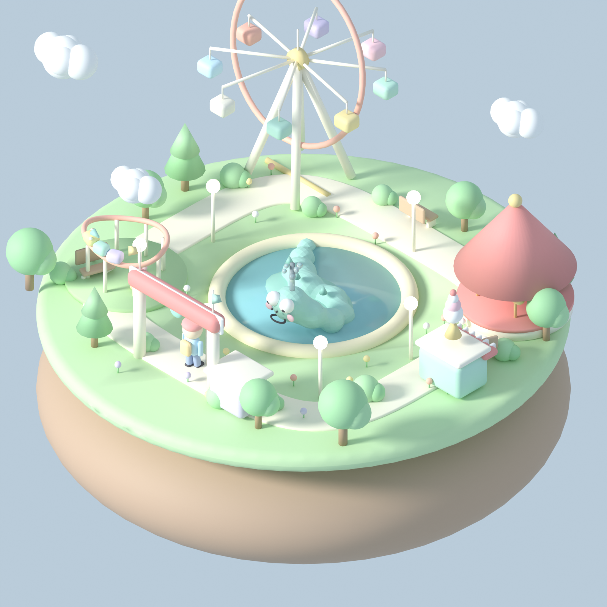

# Nessie's Lagoon — a cute isometric amusement park

A tiny, pastel, isometric **Nessie-themed amusement park** built as a fully
procedural Blender scene (`bpy`). No GPU/AI is required — it renders with
Cycles on CPU and exports a game-ready `.glb`.



## What's in the diorama

A single floating island ringed by a cream path, with everything connected to
it (you can walk the whole loop):

- **Nessie** — the chibi mascot, half-submerged in the central turquoise pond:
  three humps, a long neck, big sparkly eyes, blush, a smile, little dorsal
  bumps, and a water spout. Its face is turned toward the camera.
- **Ferris wheel** (back-left) — cream A-frame, coral rim, 8 pastel gondolas.
- **Carousel** (back-right) — red-and-cream striped tent, gold pole, 4 horses.
- **Nessie-coaster** (front-left) — a small elevated oval with a 3-car
  monster-faced train, on its own little green pad.
- **Ice-cream stand** (right) — mint booth, striped awning, a giant soft-serve.
- **Entrance arch + ticket booth** (front) — flags and a Nessie face plaque.
- **Scenery** — round & pine trees, bushes, flowers, benches, glowing
  lampposts, three puffy clouds.
- **A visitor** — a chibi character with a cap and backpack, mid-walk on the
  front path, looking at Nessie.

The design/audit/layout process is documented in [PLAN.md](PLAN.md) (idea →
self-audit → ride list & connectivity → keeping it small/cute → final plan).

## Files

| File | Purpose |
|---|---|
| `build_park.py` | Procedural scene builder (materials, island, pond, Nessie, rides, scenery, camera/lights) + Cycles render + GLB export |
| `render.sh` | Wrapper that runs `build_park.py` with the right `LD_LIBRARY_PATH` for the bpy wheel in this repo's venv |
| `PLAN.md` | The 5-step design + audit document |
| `output/nessie_park.png` | Final 1600×1600 isometric render (Cycles CPU, 64 samples) |
| `output/nessie_park.glb` | The whole diorama as a 3D asset (~2.4 MB, 58k verts, 31 materials) |

## How to build / render

```bash
# one-time: install bpy into the repo venv
python3 -m venv .venv && . .venv/bin/activate && pip install bpy

# build, render, and export (uses render.sh to set the library path)
bash examples/nessie_park/render.sh
```

Outputs land in `examples/nessie_park/output/`.

> **About `render.sh`:** the `bpy` wheel (Blender 5) links against a few GUI
> shared libraries (`libXrender`, `libXi`, `libXfixes`, `libICE`, `libSM`,
> `libGL`, `libxkbcommon`) that aren't installed in this minimal sandbox and
> are never called in headless/background mode. The script satisfies the loader
> with tiny stub shared objects in `.stublibs/` and puts bpy's bundled
> libraries (USD, OpenImageIO, OpenColorIO, TBB, …) on `LD_LIBRARY_PATH`.
> On a normal machine with a real Blender install you don't need any of this —
> just run `blender --background --python build_park.py`.

## Why it's procedural (not the AI pipeline)

The rest of this repo turns text/photos into assets via
Fooocus → Hunyuan3D → Blender → Unreal. For a *whole scene* with a specific
composition (isometric camera, connected path, a mascot facing the viewer), a
short procedural `bpy` script gives exact, reproducible, cute results and
renders in ~3 minutes on CPU. The output `.glb` can still be converted to FBX
with `bin/glb_to_fbx.sh` and imported into Unreal exactly like a Hunyuan asset.
